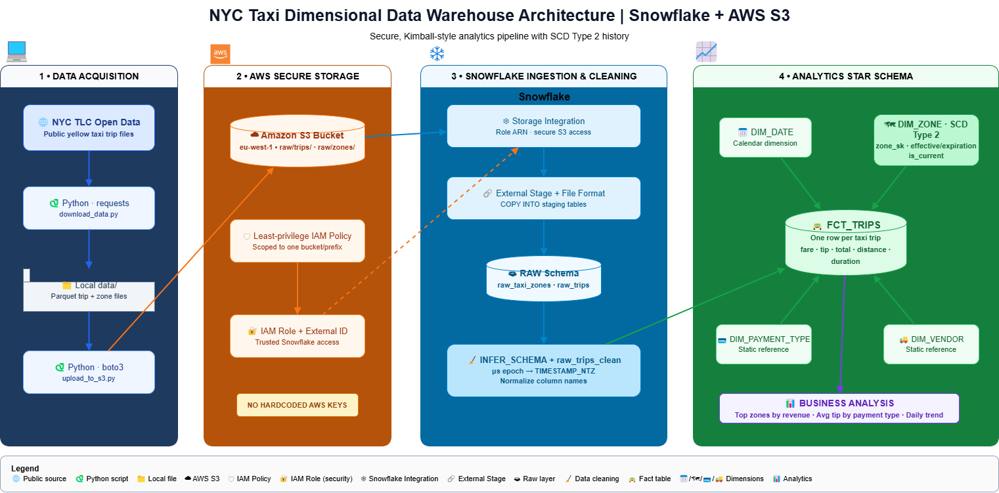
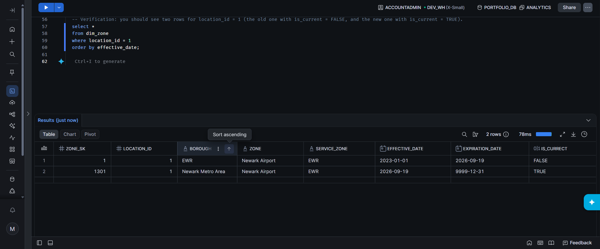

# NYC Taxi Dimensional Data Warehouse (Snowflake + AWS S3)

A Kimball-style dimensional data warehouse built on **Snowflake**, ingesting
NYC Yellow Taxi trip data from **AWS S3** through a secure, IAM-role-based
Storage Integration - no AWS keys are ever hardcoded anywhere in this project.

This project demonstrates dimensional modeling fundamentals (facts and
dimensions), **Slowly Changing Dimension Type 2** for historical accuracy,
and a real-world data cleaning problem I ran into and solved along the way.

---

## 📐 Architecture

NYC TLC Open Data (public) │ (Python + requests) ▼ Local machine (data/) │ (Python + boto3) ▼ AWS S3 bucket (eu-west-1) raw/zones/ raw/trips/ │ │ Snowflake External Stage │ (Storage Integration → IAM Role, no hardcoded keys) ▼ Snowflake RAW schema (staging tables) │ │ SQL transformations ▼ Snowflake ANALYTICS schema (star schema) FCT_TRIPS · DIM_DATE · DIM_ZONE (SCD2) · DIM_PAYMENT_TYPE · DIM_VENDOR


See `docs/architecture_diagram.png` for the visual version.



---

## 🗂️ Repository Structure

| Folder | Contents |
|---|---|
| `python/` | Scripts to download source data and upload it to S3 |
| `sql/01_setup/` | Warehouse, resource monitor, database/schema creation |
| `sql/02_raw_layer/` | File formats and raw table loading (staging layer) |
| `sql/03_dimensions/` | All dimension tables, including the SCD Type 2 logic |
| `sql/04_facts/` | The fact table build |
| `sql/05_analysis/` | Example business queries run against the final model |
| `sql/06_monitoring/` | Queries to check Snowflake credit consumption and warehouse state |
| `sql/07_teardown/` | Cleanup queries to suspend compute and remove all project resources |
| `aws/` | IAM policy used (sanitized) and setup notes |
| `docs/` | Architecture diagram and screenshots |

Run the SQL scripts **in folder order** (01 → 05) inside Snowsight to
reproduce the warehouse from scratch.

---

## 🧱 Data Model

**Fact table**
- `FCT_TRIPS` - grain: one row per taxi trip. Measures: `fare_amount`,
  `tip_amount`, `total_amount`, `trip_distance`, `trip_duration_minutes`.

**Dimension tables**
- `DIM_DATE` - standard calendar dimension, generated with `GENERATOR()`.
- `DIM_ZONE` - pickup/dropoff zones, implemented as **SCD Type 2**
  (`zone_sk` surrogate key, `effective_date`, `expiration_date`, `is_current`),
  so historical trips always point to the zone classification that was
  actually true at the time of the trip.
- `DIM_PAYMENT_TYPE`, `DIM_VENDOR` - small static reference dimensions.

---

## 🔐 Security: How Snowflake Connects to S3

This project uses Snowflake's **Storage Integration** feature instead of
hardcoded AWS access keys:

1. An IAM policy scopes access to exactly one S3 bucket/prefix.
2. An IAM role trusts a Snowflake-managed IAM user, gated by an external ID
   that Snowflake itself generates - nobody outside Snowflake can assume
   this role without that external ID.
3. Snowflake references the role ARN in a `STORAGE INTEGRATION` object,
   and an external stage reads from S3 through that integration.

No AWS secret ever appears in this codebase. See `aws/setup_notes.md`
for the full configuration steps.

---

## 🐛 A Real Debugging Story (kept intentionally, not polished away)

When I first loaded the raw Parquet file, I used Snowflake's `INFER_SCHEMA`
function to detect the source columns and types automatically, rather than
guessing the schema by hand - Parquet timestamp encodings vary by source
and I didn't want to assume.

That surfaced a real issue: the pickup/dropoff timestamp columns had been
stored as **raw microsecond-epoch integers** rather than proper `TIMESTAMP`
values (e.g. `1673193444000000`). Naively casting or formatting them as
dates produced nonsense output. I traced this by inspecting the raw values
directly, manually verified the epoch math (dividing by 1,000,000 landed on
a sensible January 2023 date), and built a dedicated cleaning step -
`raw_trips_clean` - that converts the timestamps correctly with
`TO_TIMESTAMP_NTZ()` and normalizes the column names (the inferred schema
had preserved the original mixed-case, quote-sensitive names from the
Parquet file, e.g. `"VendorID"`, `"tpep_pickup_datetime"`).

Only after that cleaning step did the fact table's date keys correctly
join against `DIM_DATE`. I'm including this in the README rather than just
the final clean SQL, because working through a data quality issue like
this - not assuming the source format, verifying it, and building a
deliberate cleaning layer - is a pretty normal day in data engineering,
and I'd rather show that than pretend everything worked on the first try.

---

## 📊 Sample Business Insight

Running `sql/05_analysis/sample_queries.sql` against the loaded sample
shows Manhattan-based pickup zones account for a disproportionate share of
total revenue, and credit card payments carry a noticeably higher average
tip percentage than cash payments - the kind of finding a business
stakeholder could act on directly from this model.

---

## 🚀 How to Reproduce This Project

### Prerequisites
- A Snowflake account (a free trial works - see [Snowflake's trial signup](https://signup.snowflake.com))
- An AWS account with an S3 bucket
- Python 3.9+

### Steps

1. **Clone this repo**
```bash
   git clone https://github.com/alibaghdadi1368/nyc-taxi-dimensional-warehouse.git
   cd nyc-taxi-dimensional-warehouse
```

2. **Download the source data**
```bash
   cd python
   pip install requests boto3
   python download_data.py
```

3. **Upload to your own S3 bucket**
   Edit `BUCKET` in `upload_to_s3.py` to your bucket name, then:
```bash
   aws configure   # enter your own AWS access key / secret / region
   python upload_to_s3.py
```

4. **Set up the Snowflake ↔ S3 connection**
   Follow the steps in `aws/setup_notes.md` to create the IAM policy, IAM
   role, and Snowflake Storage Integration (this links your own bucket to
   your own Snowflake account securely).

5. **Run the SQL scripts in order**, in Snowsight:

sql/01_setup/ (run all 3 files in order) sql/02_raw_layer/ (run all 4 files in order) sql/03_dimensions/ (run all 3 files in order) sql/04_facts/ (run the file) sql/05_analysis/ (explore the results)


---

## 🛠️ Tech Stack

**Snowflake** (SQL, dimensional modeling, `MERGE`, `INFER_SCHEMA`) ·
**AWS S3** · **AWS IAM** (Storage Integration security model) ·
**Python** (`boto3`, `requests`)

---

## 💰 Cost Awareness

Built entirely within Snowflake's free trial credits (X-Small warehouse,
60-second auto-suspend, account-level resource monitor capped at 20
credits) and a small (<100 MB) dataset well within AWS Free Tier limits.
All AWS resources (S3 bucket contents, IAM role/policy) were removed after
completing the project.

### Monitoring & Teardown

This project includes explicit SQL for two things many portfolio projects
skip:

- **`sql/06_monitoring/cost_monitoring.sql`** - checks actual credit
  consumption against the account's warehouse metering history, rather than
  just assuming the warehouse behaved as configured.
- **`sql/07_teardown/cleanup_snowflake.sql`** - suspends the warehouse
  explicitly and includes the full drop sequence (database, warehouse,
  integration, resource monitor) for a complete teardown once the project
  is finished.

## 📈 What I'd Add for a Production Version

- Automate ingestion with Snowpipe + S3 event notifications instead of a
  manually triggered `COPY INTO`
- Add `dbt` for version-controlled, tested transformations
- Add data quality tests (row count checks, null checks, referential
  integrity between fact and dimension tables)
- Parameterize the SCD Type 2 merge logic into a reusable stored procedure

---
This screenshot demonstrates the SCD Type 2 implementation in the project, where a change to a zone creates a new current record while preserving the previous version as historical data.


---

## 📬 Contact

**Ali Baghdadi** : [LinkedIn](https://linkedin.com/in/alibaghdadi)  
alibaghdadi1368@gmail.com